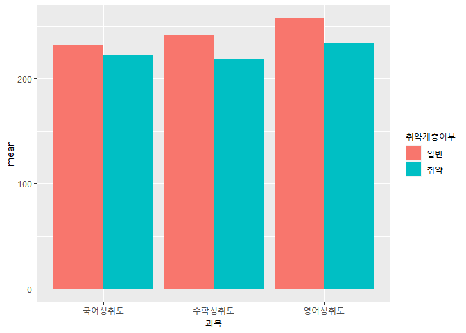
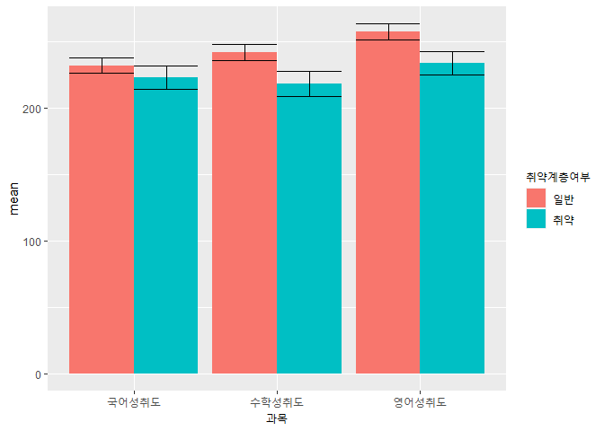
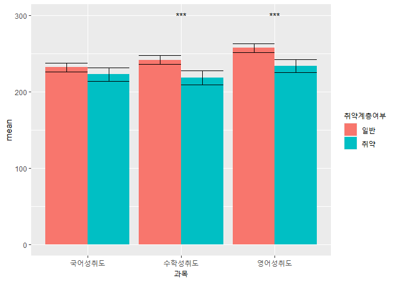

2023-1학기 데이터시각화</br></br>14주차 보충자료 code
================
Wooyoul Na </br>

## Intro

-   본 강좌에서는 package `rstatix`를 이용하여 통계적 추론에 대한
    시각화를 실시하는 방법을 실습

    -   95% 신뢰구간 표기

    -   독립표본 t-검정 결과 시각화

-   `rstatix`를 이용하면 여러 면에서 간편하게 통계적 추론 결과를
    시각화로 표현 가능

-   그러나 컴퓨터 환경에 따라 `rstatix` 설치에 있어 어려움이 있어,
    `rstatix` 없이 신뢰구간 및 t-검정 결과를 시각화하는 보충자료를
    추가로 공유

</br>

## 시작 전

### package `dplyr` and `ggplot2` loading

``` r
## package loading
library(dplyr)
library(ggplot2)
```

</br>

### 14주차 데이터 loading

``` r
## data loading : file.choose()로 KELS_samp.csv 불러오기

## 데이터 불러오기에서 에러 발생 시, KELS_samp.csv를 메모장으로 열기  

## 그 후, "다른 이름으로 저장" 시 Encoding을 ANSI 혹은 UTF-8로 변경하여 저장한 후 다시 불러오기
KELS_samp = read.csv(file.choose())
```

</br>  
</br>

## Step 1. `psych`를 사용한 평균, 표준오차, 신뢰구간 등 산출

-   `rstatix`를 사용하지 않고도, 집단별 평균, 표준오차, 신뢰구간 등을
    산출 가능함

-   하지만 `dplyr`의 `summarize()`를 사용할 경우, 여러 개의 통계치에
    대한 결과를 산출하는 것은 여전히 매우 불편

-   따라서, `rstatix`에 비해 **package의 설치에서 안정적인 package
    `psych`의 기능을 이용할 것**

    -   package `psych`가 설치되어 있지 않다면, 먼저
        `install.packages("psych")` 실행

    -   설치가 되어있는 경우, `library(psych)`만 실행

``` r
# 이 부분은 psych가 없는 경우에만 실행
## install.packages("psych") 

library(psych)
```

</br>

-   `psych` 내 `describeBy()`라는 명령어를 이용하면, 집단별로 여러
    통계치에 대한 결과를 쉽게 산출 가능

    -   단, `rstatix`에 비해 후속 작업이 약간 번거로움

``` r
## psych의 describeBy()를 이용한 통계치 산출
desc.grp=KELS_samp %>% 
  select(국어성취도, 수학성취도, 영어성취도, 취약계층여부) %>%
  describeBy(group="취약계층여부")

## 결과 확인
desc.grp
```

    ## 
    ##  Descriptive statistics by group 
    ## 취약계층여부: 일반
    ##               vars   n   mean    sd median trimmed   mad min max range  skew
    ## 국어성취도       1 295 232.16 49.04    242  234.27 54.86 140 320   180 -0.33
    ## 수학성취도       2 295 241.84 52.07    242  242.41 69.68 147 324   177 -0.05
    ## 영어성취도       3 295 257.64 51.28    262  260.16 66.72 150 331   181 -0.27
    ## 취약계층여부*    4 295   1.00  0.00      1    1.00  0.00   1   1     0   NaN
    ##               kurtosis   se
    ## 국어성취도       -1.02 2.86
    ## 수학성취도       -1.24 3.03
    ## 영어성취도       -1.03 2.99
    ## 취약계층여부*      NaN 0.00
    ## ------------------------------------------------------------ 
    ## 취약계층여부: 취약
    ##               vars   n   mean    sd median trimmed   mad min max range  skew
    ## 국어성취도       1 105 222.97 45.50    228  223.67 43.00 140 312   172 -0.18
    ## 수학성취도       2 105 218.50 49.20    204  215.80 48.93 147 324   177  0.50
    ## 영어성취도       3 105 233.85 44.81    224  233.69 51.89 150 331   181  0.07
    ## 취약계층여부*    4 105   1.00  0.00      1    1.00  0.00   1   1     0   NaN
    ##               kurtosis   se
    ## 국어성취도       -0.61 4.44
    ## 수학성취도       -0.84 4.80
    ## 영어성취도       -0.85 4.37
    ## 취약계층여부*      NaN 0.00

</br>

-   `psych`의 `describeBy()`는 산출 결과를 집단별로 다른 table에 각각
    제시함

-   그래프 작성을 위하여는, 해당 table을 하나로 합치는 작업을 실시할
    필요가 있음

``` r
## 일반학생 집단의 결과: desc.grp.1
desc.grp.1 = desc.grp$일반 %>% 
  as.data.frame() %>% 
  select(n,mean,se) %>% 
  mutate(과목=rownames(.),
          취약계층여부="일반") %>% 
  filter(과목!="취약계층여부*")

## 취약계층 학생 집단의 결과: desc.grp.2
desc.grp.2 = desc.grp$취약 %>% 
  as.data.frame() %>% 
  select(n,mean,se) %>% 
  mutate(과목=rownames(.),
          취약계층여부="취약") %>% 
  filter(과목!="취약계층여부*")
```

-   여기에 더하여, 집단별 표준오차(`se`)를 이용하여 95% 신뢰구간을 산출

    -   95% 신뢰구간 산출은 수동으로 직접 계산이 필요함(11주차, 12주차
        강의자료 참고)

-   이를 위하여는 다음과 같이 명령어를 작성 후 실행

``` r
## 일반 학생의 95% 신뢰구간(ci)
desc.grp.1 = desc.grp.1 %>% 
  mutate(ci=se*abs(qt(0.05/2,df=n-1)))

## 취약계층 학생의 95% 신뢰구간(ci)
desc.grp.2 = desc.grp.2 %>% 
  mutate(ci=se*abs(qt(0.05/2,df=n-1)))
```

-   결과 확인(예. 일반학생)

``` r
desc.grp.1
```

    ##              n     mean       se       과목 취약계층여부       ci
    ## 국어성취도 295 232.1627 2.855282 국어성취도         일반 5.619383
    ## 수학성취도 295 241.8407 3.031849 수학성취도         일반 5.966878
    ## 영어성취도 295 257.6373 2.985746 영어성취도         일반 5.876145

-   이제 일반학생과 취약계층 학생 결과를 서로 합쳐야 함

    -   현재는 데이터의 행 이름이 자동으로 표기되나, 이것이 거슬리므로
        없애주는 작업도 함께 진행

``` r
## 데이터 합치기
meantab = rbind(desc.grp.1,desc.grp.2)

## 행 이름 제거
rownames(meantab)=NULL

## 필요한 정보들만 선택하기
meantab = meantab %>% 
  select(취약계층여부,과목, n, mean, se, ci)
```

-   마지막 확인

``` r
meantab
```

    ##   취약계층여부       과목   n     mean       se       ci
    ## 1         일반 국어성취도 295 232.1627 2.855282 5.619383
    ## 2         일반 수학성취도 295 241.8407 3.031849 5.966878
    ## 3         일반 영어성취도 295 257.6373 2.985746 5.876145
    ## 4         취약 국어성취도 105 222.9714 4.440499 8.805676
    ## 5         취약 수학성취도 105 218.4952 4.801864 9.522277
    ## 6         취약 영어성취도 105 233.8476 4.372613 8.671055

</br>

## Step 2. 막대그래프 작성

-   `meantab`이 완성되었으면, 이제 막대그래프를 작성

-   이 과정은 수업 때 진행하였던 과정과 유사하게 진행

``` r
ggplot(meantab, aes(과목, mean))+
  geom_col(aes(fill=취약계층여부),position="dodge")
```

<!-- -->

</br>

## Step 3. 신뢰구간 시각화 표현

-   막대그래프에 집단별 신뢰구간 범위도 함께 표시할 수도 있음

    -   이 역시 수업에서 실시한 `geom_errorbar()` 이용

``` r
ggplot(meantab, aes(과목, mean))+
  geom_col(aes(fill=취약계층여부),position="dodge")+
  geom_errorbar(aes(ymin=mean-ci,ymax=mean+ci,group=취약계층여부),
                position="dodge")
```

<!-- -->

</br>

-   이와 같이 진행하면, 막대그래프와 신뢰구간 표기까지 완료됨

-   그러나 이에 추가로, 독립표본 t-검정에 대한 결과도 함께 제시 가능

</br>

## Step 4. 독립표본 t-검정을 통한 집단 간 차이 검증

-   독립표본 t-검정을 실시하기에 앞서, levene의 등분산 검정을 실시해야
    함

    -   R에는 기본적으로 등분산 검정을 위한 명령어가 없음

    -   하지만 `rstatix`를 사용하지 못하는 상황이라면, 대신 package
        `car`를 이용하여 등분산 검정을 대신 실시 가능

        -   이 경우, `leveneTest()`를 이용

``` r
# install.packages("car") : 설치되지 않았을 때에 1회 실행  
library(car) # package 불러오기
```

-   `rstatix`의 `levene_test()`와 사용법 자체는 유사하지만,
    `leveneTest()`는 `dplyr`과는 호환되지 않으므로, `dplyr`을 사용하지
    않고 직접 진행

``` r
## 국어성취도: 등분산 검정  
leveneTest(KELS_samp$국어성취도~KELS_samp$취약계층여부,center="mean")
```

    ## Levene's Test for Homogeneity of Variance (center = "mean")
    ##        Df F value  Pr(>F)  
    ## group   1  3.5213 0.06132 .
    ##       398                  
    ## ---
    ## Signif. codes:  0 '***' 0.001 '**' 0.01 '*' 0.05 '.' 0.1 ' ' 1

``` r
## 수학성취도: 등분산 검정  
leveneTest(KELS_samp$수학성취도~KELS_samp$취약계층여부,center="mean")
```

    ## Levene's Test for Homogeneity of Variance (center = "mean")
    ##        Df F value Pr(>F)
    ## group   1  2.0449 0.1535
    ##       398

``` r
## 영어성취도: 등분산 검정  
leveneTest(KELS_samp$영어성취도~KELS_samp$취약계층여부,center="mean")
```

    ## Levene's Test for Homogeneity of Variance (center = "mean")
    ##        Df F value  Pr(>F)  
    ## group   1  5.7677 0.01678 *
    ##       398                  
    ## ---
    ## Signif. codes:  0 '***' 0.001 '**' 0.01 '*' 0.05 '.' 0.1 ' ' 1

</br>

-   등분산 검정 결과를 확인한 이후에는, R의 기본 명령어 `t.test()`를
    이용하여 독립표본 t-검정 실시 가능

    -   `rstatix`의 `t_test()`와 사용법은 유사

    -   하지만 `dplyr`과의 호환이 되지 않는 점과 더불어, 분석 결과가
        보기 불편하게 나온다는 것이 단점

``` r
# 국어 t-검정
res.kor=t.test(KELS_samp$국어성취도~KELS_samp$취약계층여부,var.equal=TRUE)

# 수학 t-검정
res.mat=t.test(KELS_samp$수학성취도~KELS_samp$취약계층여부,var.equal=TRUE)

# 영어 t-검정
res.eng=t.test(KELS_samp$영어성취도~KELS_samp$취약계층여부,var.equal=FALSE)
```

-   결과 확인(예: 국어성취도)

``` r
res.kor   
```

    ## 
    ##  Two Sample t-test
    ## 
    ## data:  KELS_samp$국어성취도 by KELS_samp$취약계층여부
    ## t = 1.6801, df = 398, p-value = 0.09372
    ## alternative hypothesis: true difference in means between group 일반 and group 취약 is not equal to 0
    ## 95 percent confidence interval:
    ##  -1.563781 19.946348
    ## sample estimates:
    ## mean in group 일반 mean in group 취약 
    ##           232.1627           222.9714

</br>

## Step 4. 독립표본 t-검정 시각화

-   R 기본 명령어 `t.test()`를 통해, 과목별 t-검정 결과를 확인 가능

-   그러나 현재는 t-검정의 결과가 데이터로 제시되어 있지 않기 때문에,
    시각화로 제시할 수 있도록 결과를 데이터로 다듬는 작업 필요

    -   국어, 수학, 영어성취도에 대한 주요 결과를 하나의 table로 통합

    -   통합하는 김에, p-value의 값에 따라 별(`*`) 표기도 맞추어 실시

``` r
test.df = data.frame(성취도=c("국어성취도","수학성취도","영어성취도"),
           p=c(res.kor$p.value,res.mat$p.value,res.eng$p.value)) %>% 
  mutate(label=case_when(p>= 0.05~"",
                         p<0.05 & p>=0.01~"*",
                         p<0.01 & p>= 0.001~"**",
                         p<0.001~"***"))
```

-   결과 확인

``` r
test.df
```

    ##       성취도            p label
    ## 1 국어성취도 9.372346e-02      
    ## 2 수학성취도 7.505601e-05   ***
    ## 3 영어성취도 1.165161e-05   ***

</br>

-   여기까지 진행되었으면, 이제 독립표본 t-검정의 결과를 시각화로 표현
    가능

    -   `geom_text()`를 이용하여, 그래프 내 별표 표기하기

``` r
ggplot(meantab, aes(과목, mean))+
  geom_col(aes(fill=취약계층여부),position="dodge")+
  geom_errorbar(aes(ymin=mean-ci,ymax=mean+ci,group=취약계층여부),
                position="dodge") + 
  geom_text(data=test.df, aes(x=성취도,y=300,label=label))
```

<!-- -->
