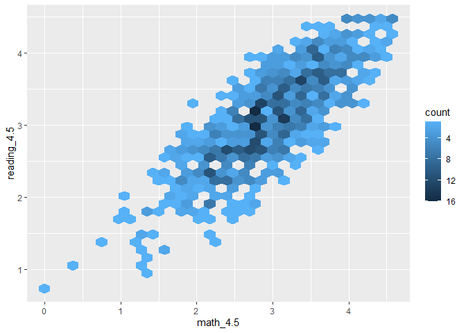
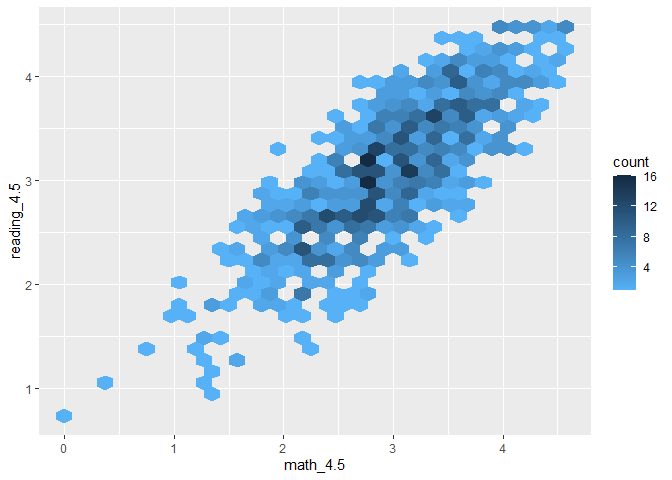

2023-1학기 데이터시각화</br></br>6주차 보충자료 code
================
Wooyoul Na </br>

## 시작 전 (1): package `dplyr` and `ggplot2` loading

``` r
## package loading
library(dplyr)
library(ggplot2)
```

## 시작 전 (2): 6주차 loading

``` r
## data loading : file.choose()로 studperf_w6.csv 불러오기
studperf_w6 = read.csv(file.choose())
```

</br>  
</br>

## Question : `geom_hex()` 사용 시, 색상의 순서 바꾸기

-   `geom_hex()`를 사용할 경우, 기본적으로 빈도 수가 많은 부분일수록
    색상이 밝은 색으로 표기됨

-   `geom_hex()` 사용 시, 빈도 수가 많을수록 어두운 색으로 표현하고자 할
    경우, 추가적으로 명령어를 작성해야 함

-   아직 본 강좌에서는 다루지 않았으나, `ggplot2`에서
    `scale_fill_continuous()`에 대한 명령어를 추가로 작성하면, 색상의
    순서를 변화시킬 수 있음

    -   이러한 방법들에 대하여는 중간과제 기간 이후 수업 시간에 다룰
        예정

``` r
ggplot(studperf_w6, aes(x=math_4.5, y=reading_4.5))+
  geom_hex()+ # hex-bin plot
  scale_fill_continuous(trans="reverse") # hex-bin plot의 색상을 기본 색상에서 반대로 설정
```

<!-- -->

</br>

-   그러나 이 방법을 사용하면, 우측의 범례(legend) 순서가 바뀜. 낮은
    숫자가 위쪽에 놓이게 되는데, 이 또한 바꾸고자 한다면, 범례에 대한
    조정을 할 수 있는 `guides()` 명령어를 추가로 덧붙여 해결 가능

</br>

``` r
ggplot(studperf_w6, aes(x=math_4.5, y=reading_4.5))+
  geom_hex()+ # hex-bin plot
  scale_fill_continuous(trans="reverse")+ # hex-bin plot의 색상을 기본 색상에서 반대로 설정
  guides(fill = guide_colorbar(reverse = TRUE)) # colorbar의 순서를 반대로 조정
```

<!-- -->
